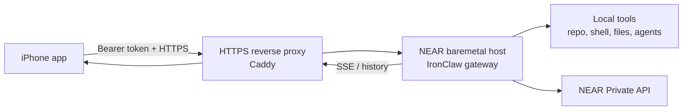

# IronClaw Remote Bridge

The iPhone app should not depend on a Mac or LAN gateway for normal NEAR Private Chat. Hosted IronClaw is different: it can work from an iPhone if the user's computer exposes a small authenticated HTTPS bridge.

As of 2026-05-23, this app has been smoke-tested against the official IronClaw `0.28.2` release through:

```text
https://dangwalvaidy.family/ironclaw
```

The hosted bridge reports `version: 0.28.2`, `engine_v2_enabled: true`, and the public route accepted an `IronClaw Agent` chat and returned a completed assistant response (`IronClaw bridge live.`).

Current relay topology:

```text
iPhone app
  -> https://dangwalvaidy.family/ironclaw
  -> Caddy on the public relay
  -> authenticated Chisel reverse tunnel over HTTPS /chisel/
  -> baremetal3.agents.near.ai localhost:18789
  -> IronClaw 0.28.2 gateway
```

The direct SSH paths between the public relay and the NEAR baremetal host are blocked by network policy, so the relay intentionally uses outbound HTTPS on port `443`.

## Target Shape



## Mobile Contract

The iOS app already knows how to talk to these bridge endpoints:

- `GET /api/health`, `GET /api/status`, or `GET /api/gateway/status`
- `POST /api/chat/thread/new`
- `POST /api/chat/send`
- `GET /api/chat/events`
- `GET /api/chat/history?thread_id=...&limit=5`
- `POST /api/chat/gate/resolve`

Every request should accept `Authorization: Bearer <token>`.

## Bridge Requirements

1. The bridge must be reachable from the phone over public HTTPS.
2. It must reject unauthenticated requests.
3. It must return final answer text, not only transport status such as `accepted`, `queued`, or `running`.
4. It should expose SSE events when possible and history polling as fallback.
5. It should preserve thread state by `thread_id`.
6. It should support approval gates for destructive desktop tools.
7. It must produce visible assistant text within the mobile timeout window; transport-only states are treated as failures by the app.

## Recommended Hosted Setup

For a stable phone-ready endpoint, run IronClaw on a server and put Caddy or another TLS reverse proxy in front of it. If the IronClaw host is directly reachable from the proxy:

```caddy
example.com {
  handle_path /ironclaw/* {
    reverse_proxy 127.0.0.1:3100 {
      flush_interval -1
      transport http {
        read_timeout 600s
        write_timeout 600s
      }
    }
  }
}
```

Then configure the iOS app:

- Model: `IronClaw Agent`
- Bridge URL: `https://example.com/ironclaw`
- Bearer token: `GATEWAY_AUTH_TOKEN` from the IronClaw host environment

Use Account -> IronClaw Bridge -> Test before sending a chat.

If the IronClaw host is not directly reachable from the proxy, run an authenticated reverse tunnel and point Caddy at the local tunnel listener instead:

```caddy
example.com {
  handle_path /chisel/* {
    reverse_proxy 127.0.0.1:32080
  }

  handle_path /ironclaw/* {
    reverse_proxy 127.0.0.1:31879 {
      flush_interval -1
      transport http {
        read_timeout 600s
        write_timeout 600s
      }
    }
  }
}
```

The current production relay uses:

- Public relay service: `ironclaw-chisel-server.service`
- Tunnel server: `127.0.0.1:32080`
- Tunnel listener for IronClaw: `127.0.0.1:31879`
- Baremetal gateway: `127.0.0.1:18789`

## Local Demo Setup

1. Run IronClaw bridge on the computer, bound to localhost.
2. Put a tunnel in front of it:
   - Cloudflare Tunnel for a stable domain.
   - Tailscale Funnel for private mesh users.
   - ngrok for quick demos.
3. Paste the HTTPS URL and bearer token into Account -> IronClaw Bridge on iOS.
4. Use the model picker only after Test succeeds.

Quick helper:

```sh
./scripts/start-ironclaw-https-bridge.sh
```

The helper starts the local IronClaw gateway, then runs Cloudflare Tunnel or ngrok if installed. Leave the terminal open while testing from iPhone. It hides the gateway token by default; run with `PRINT_GATEWAY_TOKEN=1` only when you are ready to paste the token into the app.

## Why LAN URLs Stay Blocked

Direct `localhost`, `192.168.x.x`, `10.x.x.x`, and `.local` endpoints are fragile on iPhone: they break off-Wi-Fi, are hard to secure, and are not App Store-safe as the primary path. The bridge can still run on the user's computer, but the iPhone should connect through authenticated HTTPS.

## Next Implementation Pass

- Add a small desktop bridge package with the endpoint contract above.
- Add QR pairing so the desktop can transfer the bridge URL and token to the phone.
- Add heartbeat and last-seen status in Account.
- Add run logs and a final-output assertion on the desktop bridge so transport-only responses never appear as assistant answers.
